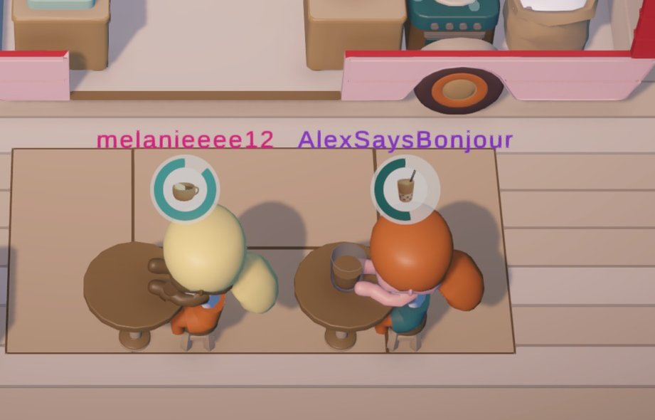
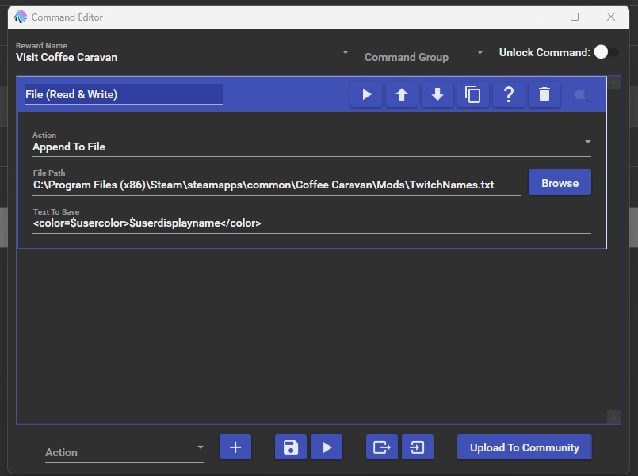

# Twitch Integration for Coffee Caravan

This mod adds customer names above every customer that visits your caravan. These names could be generated 
from the people in your chat, by using a command in chat, a Twitch channel point redemptions, or manually.



Currently the mod loops through all the customer names one by one, and then repeats. It's not possible to have 
a customer name only visit once and then not show up again until e.g. they redeem again, because I figured 
this would be too spammy. If you'd like this possibility, feel free to ask on the discord below.

This guide will get you up and running from scratch with an example for integration using Mix It Up Bot and Twitch.

If at any point you get stuck or have questions, feel free to reach out on Discord: https://discord.gg/q5bZ92Y5cj

### Requirements

1. Coffee Caravan on Windows
2. MelonLoader
3. This mod
4. (Optionally) A bot running on your computer like Mix It Up Bot to automate customer name collection.

### What you need to know first

Before you begin, you'll need to know where Coffee Caravan is installed. You can find this folder by 
right clicking on the game in Steam, going to Properties, then Installed Files, then clicking the Browse button.


### Installing MelonLoader

MelonLoader is a mod loader that works for all Unity based games. If you'd like to, you can follow their instructions: https://melonwiki.xyz/#/README

Alternatively:

1. Make sure you have the .net Framework 4.8 Runtime installed (https://dotnet.microsoft.com/download/dotnet-framework/net48)
2. Download and run the Automated MelonLoader installer: https://github.com/HerpDerpinstine/MelonLoader/releases/latest/download/MelonLoader.Installer.exe
3. When the MelonLoader dialog appears, click "Select" and browse to your Coffee Caravan folder, then select Coffee Caravan.exe
4. Leave everything else as the default, and click Install

To test that it's working, run the game once from Steam. You'll see a window open and a lot of text will start scrolling by.
Don't worry, this is normal :) You can quit the game again after that.

### Installing this mod

Go to the Releases page for the mod here on Github: https://github.com/Morthy/coffee-caravan-mods/releases

Find the latest Twitch Integration and download Twitch.zip. This contains a file called Twitch.dll.
Simply extract Twitch.dll into the Mods folder inside your Coffee Caravan folder and the mod will be installed.

You can verify the mod is installed by running Coffee Caravan again. Once it's running, tab to your 
MelonLoader console and you should see the mod listed like this:

```
[22:02:40.633] ------------------------------
[22:02:40.633] Twitch Integration v0.0.1
[22:02:40.633] by Morthy
[22:02:40.633] Assembly: Twitch.dll
[22:02:40.633] ------------------------------
[22:02:40.634] ------------------------------
[22:02:40.634] 1 Mod loaded.

```

At the bottom you should see this as well:

```[22:02:40.955] [Twitch_Integration] Customer names will be loaded from C:\Program Files (x86)\Steam\steamapps\common\Coffee Caravan\Mods\TwitchNames.txt```

### Providing customer names

Customer names are read from a text document called "TwitchNames.txt" within your Coffee Caravan/Mods folder.
The mod only starts working once there's at least 4 names in the file.

If you'd like to test the mod out, you can create this file yourself and write some test names like this:

```
Jonathan
Melanie
Alexis
Lucy
George
```

Next time a customer visits, you'll see the customer name above their head. You can edit this file at any time
and the mod will update in-game accordingly.

For integration with a chatbot, just have your bot add a new line to the text file on every channel point redemption,
on command usage, or however you prefer it.

If you'd like to set the colours of names, for example to match their Twitch name colour, you can do so like this:

```
<color=#8A2BE2>Jonathan</color>
<color=#FF007F>Melanie</color>
<color=#D485AF>Alexis</color>
<color=#E8809B>Lucy</color>
```

### Automating names with Twitch and Mix It Up Bot

This assumes you already have Mix It Up Bot installed and working on your computer.

If you're adding a Channel Point redemption, go to "Twitch channel points" in the side menu. For a command, go to "Commands".

Once your redemption or command is created, open up the command editor and:

1. Add a new Action of type "Append To File"
2. Set the File Path as the path to your Coffee Caravan Mods folder, and then add "\TwitchNames.txt". Example full path: `C:\Program Files (x86)\Steam\steamapps\common\Coffee Caravan\Mods\TwitchNames.txt`
3. Set the Text To Save as: `<color=$usercolor>$userdisplayname</color>`



To prevent duplicates, you can either set the Channel Point redemption in Twitch to once per stream, or add a long cooldown to the command.

You can do a test run of the command in Mix It Up, and you should see that the file is created and a new line is added each time it's used.

### Resetting the names each stream

Simply delete the TwitchNames.txt file before you stream again if you want to reset its contents.
The mod currently does not filter out duplicates, so this is recommended.

If you're using Mix It Up, you can add a Stream start event that deletes the TwitchNames.txt file.

### Need help?

I have a discord with a section for my mods: https://discord.gg/q5bZ92Y5cj